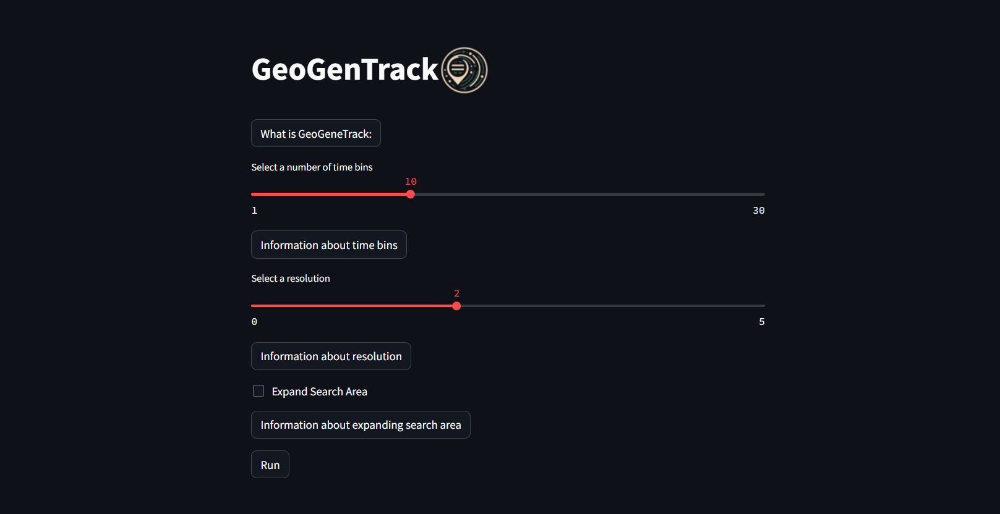
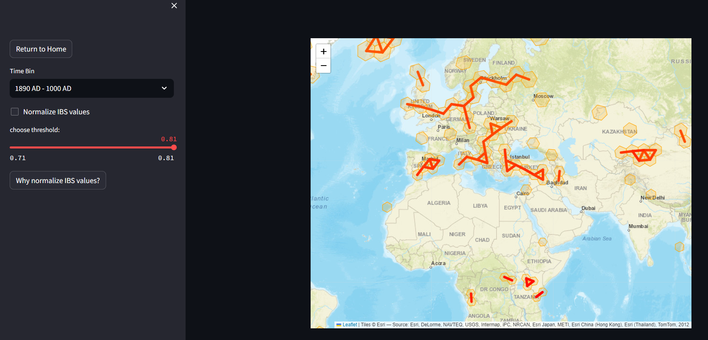

# GeoGeneTrack

## Introduction

GeoGenTrack is a bioinformatics tool designed to explore the relationship between genetic and geographical distances using ancient DNA data. It employs the AADR dataset, which consists of approximately 10,000 ancient DNA samples analyzed across 1,233,013 genomic sites. The tool identifies areas where the expected correlation between geographical and genetic distances does not hold by organizing data into geographic hexagons and time bins, which can be customized by the user. It calculates the average Identity by State (IBS) among neighboring hexagons and visualizes this data on a map, allow the identification of violations in the genetic-geographic distance correlation. GeoGenTrack offers features like customizable precision searching, efficient violation identification, and extended neighbor analysis, making it a valuable resource for researchers interested in the dynamics of genetic diversity and population movements over time. The tool's efficiency, however, is limited by the explanatory power of IBS for genetic distances.

### What makes GeoGenTrack uniqe

- coustumizable time bins and hexagon resolution
- vizualisation of IBS between groups of samples on a global map
- Ability to filter data using specified thresholds

## Setup

### Conda env

To ensure that the project's dependencies do not conflict with those of other projects, we create a new Conda environment, and load it whit all dependencies that are needed for the application by setting geogentrack.yml as the file parameter.

```{bash}
conda env create --name geogentrack --file==envs/geogentrack.yml python=3.12.2
conda activate geogentrack
```

conda version: 23.7.4

### Install Streamlit

For the web-based user interface, we utilize Streamlit. To ensure the application functions properly on your system, please follow these instructions to install Streamlit:

```{bash}
pip install streamlit
```

Should you encounter any issues during the installation process, please consult the following webpage for assistance:
<https://docs.streamlit.io/get-started/installation>

### How to get the IBS matrix

Before you can use the application, it's crucial to have the Identity by State (IBS) matrix prepared. To obtain the necessary IBS matrix for the software, there are two distinct methods available.

#### Download the ibs_dist.mibs.pkl

The simplest method to acquire the IBS matrix is by downloading it from the provided link. After downloading, the matrix must be placed in the 3_ibs_dist/ directory located within the GeoGenTrack directory.
link: <https://drive.google.com/drive/u/3/folders/1mh_AfML7DDK2JIpAkX7jHlWRADjI1Z1Z>

IMPORTANT:
Do not rename the file.
This is how the relative path of the file should look like: 3_ibs_dist/ibs_dist.mibs.pkl

#### Create the ibs_dist.mibs.pkl

The second way, is to create the file yourself. For that the python script scr/initial_run.py has to be run. For this to work the script needs a directory called 0_data/ which has to include the following files

- AADR Annotation.xlsx
- samples.bed
- samples.fam
- samples.bim

Once assured that the files are in the 0_data/ directory run the initial_run python script.

```{bash}
python scr/initial_run.py
```

### Before running

- make sure that you created and activated the conda environment with the given yml file

- make sure that your working directory contains the following files:
  - 0_data/Ancient_samples.txt
  - 3_ibs_dist/ibs_dist.mibs.pkl

## Usage

Now the interactive GeoGenTrack can be started with the following bash command.

```{bash}
streamlit run scr/app.py
```

This should automatically open a browser window with the GeoGEnTrack application which looks like this:



You can now tailor the number of time segments and the clarity of the hexagonal zones. Additional details are accessible through the buttons on the home screen.

Once the program is executed with your specified settings, the main screen will be displayed.



Now, you can delve into the average Identity By State (IBS) among hexagons tailored to your preferences.

- The dropdown menu enables you to switch among various time intervals.
- The "Normalize IBS" feature adjusts the values to a range between 0 and 1, enhancing the visibility of variations across different regions.
- The threshold slider allows you to set an upper limit, determining which average IBS distances will be represented on the map.

## License

. While the software is free to use, modify, and distribute, we ask all users and developers to acknowledge its use in their work by citing the following link: <https://github.com/JaSt17/GeoGeneTrack>

## Contact Information

If there are any problems with the application please file an issue on GitHub.
